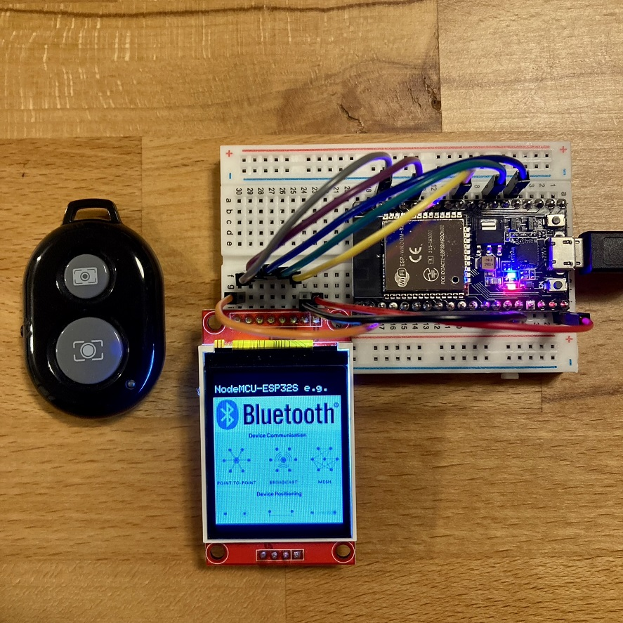
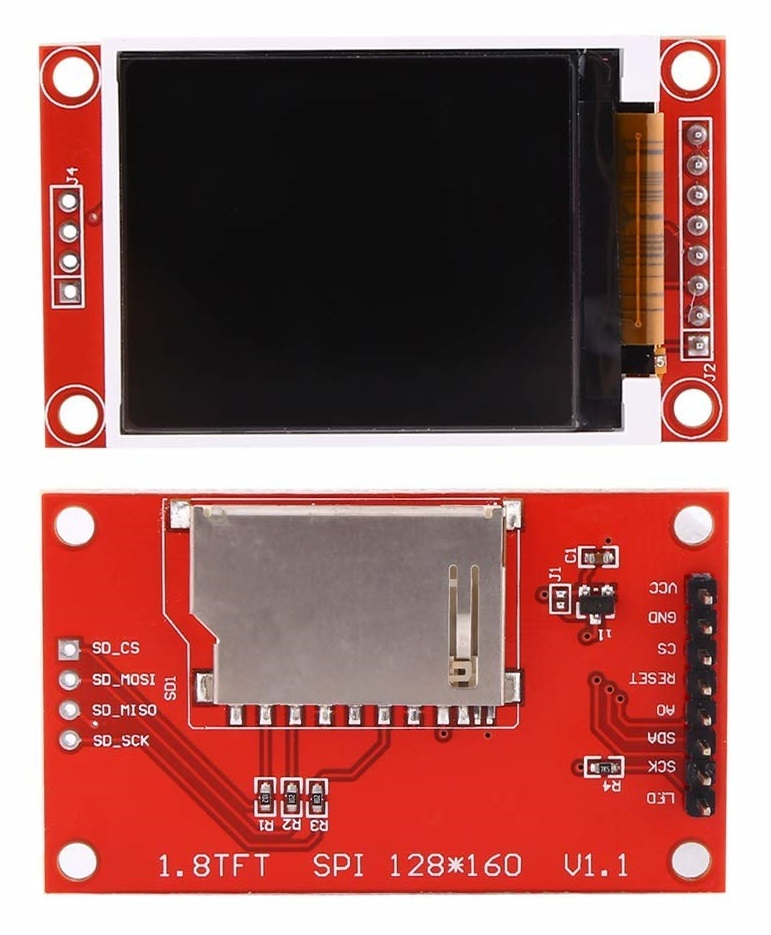
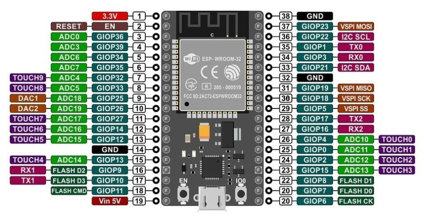
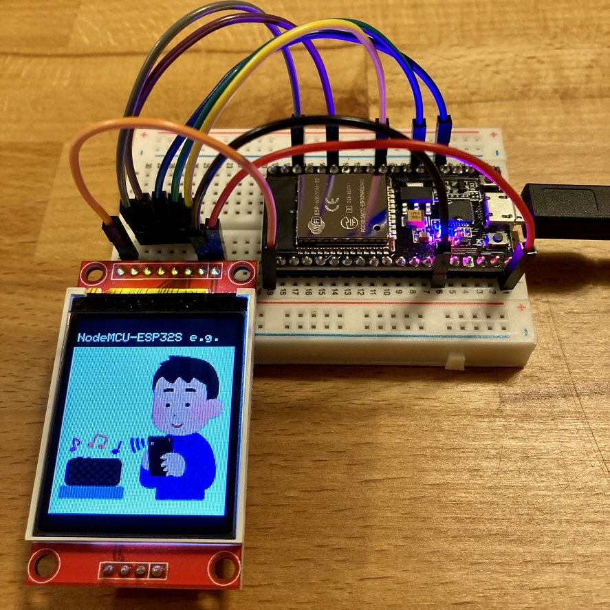

<!-- ABOUT THE PROJECT -->

# 1. プロジェクトについて

NodeMCU-ESP32S を対象としたプロジェクトです。  
スマホ用の BLE リモコンと NodeMCU-ESP32S を接続し、  
LittleFS で ESP32 へ アップロードした画像を BLE リモコンのボタンで切り替えることができるスケッチです。

本スケッチで使用する BLE リモコンは、ダイソーや AliExpress（Bluetooth カメラリモコン）で販売されているものが使用できます。  
Bluetooth の HID（Human Interface Device）として動作していますので、次の UUID を使用して接続しています。

- Human Interface Device Service UUID : 0x1812
- Report Characteristic UUID : 0x2A4D

本スケッチでは以下のパネルをサポートしています。

| ST7735 128x160                                    |
| ------------------------------------------------- |
|  |

(<a href="#readme-top">back to top</a>)

<!-- USAGE EXAMPLES -->

# 2. Arduino IDE

Arduino IDE 1.8.19 を使用しています。「ESP32 Sketch Data Upload」ツールを使用するためです。  
ライブラリは動作確認ができているバージョンです。

- ボードマネージャの追加
  - [ファイル>基本設定>追加のボードマネージャ]：[Arduino-ESP32 の json](https://docs.espressif.com/projects/arduino-esp32/en/latest/installing.html) から追加
  - [ツール>ボード>ボードマネージャ]：「esp32 by Espressif Systems」をインストール
- ボードマネージャの選択
  - [ツール>ボード]：「ESP32 Arduino」の「ESP32 Dev Module」を選択
- ライブラリのインストール
  - [ライブラリマネージャ]：「Adafruit GFX Library 1.11.5」をインストール
- ツールインストール
  - [LittleFS](https://github.com/lorol/LITTLEFS)からツールを取得し、Arduino インストールフォルダの tools フォルダへコピーする

(<a href="#readme-top">back to top</a>)

# 3. 配線図

## 3.1. NodeMCU-ESP32S

## 3.2. ST7735 128x160

| TFT    | ESP32  |
| ------ | ------ |
| LED    | 3.3V   |
| SCK    | GPIO22 |
| SDA    | GPIO21 |
| A0(DC) | GPIO2  |
| RESET  | GPIO4  |
| CS     | GPIO5  |
| GND    | GND    |
| VCC    | 3.3V   |

(<a href="#readme-top">back to top</a>)

# 4. 環境構築

## 4.1. 書き込み

PC と ESP32 を USB で接続し、Arduino IDE が起動できている状態からの手順です。

1. ツールの「ESP32 Sketch Data Upload」を選択し data の bmp ファイル をコピー
1. スケッチの「マイコンボードに書き込む」を選択
1. 起動後画面に"NodeMCU-ESP32S e.g."と表示されます

## 4.2. BLE リモコンと接続

書き込みが完了し、NodeMCU-ESP32S と BLE リモコンの電源が入っていない状態からの手順です。

1. BLE リモコンの電源を入れる（LED が点滅）
1. NodeMCU-ESP32S の電源を入れる
1. 起動後画面に"NodeMCU-ESP32S e.g."と表示されます
1. BLE リモコンの LED が消灯し、画面に"done"と表示されます（BLE 接続完了）
1. BLE リモコンのボタンを押すと画面に画像が表示されます

接続がうまく行かない場合、シリアルモニタのログで状態を確認ください。  
また USB の電源供給が不足している可能性もあります。その場合には以下をお試しください。

- USB を太いもの(2A 通せるもの)に変更する
- USB HUB を通さず PC に直接つなぐ
- 電源を持つ USB HUB を使用する
- PC でなく USB 充電器に接続する

(<a href="#readme-top">back to top</a>)

# 5. 画像

(<a href="#readme-top">back to top</a>)

# 6. 参考

- [Arduino IDE](https://www.arduino.cc/en/software)
- [ESP-WROOM-32](https://www.digikey.jp/ja/product-highlight/s/schtoeta/esp32-wroom-32-wi-fi-bluetooth-module?utm_adgroup=General&utm_source=google&utm_medium=cpc&utm_campaign=Dynamic%20Search_JP_Product_RLSA_Purchaser&utm_term=&productid=&gclid=CjwKCAjw3dCnBhBCEiwAVvLcu3xY1uTytVSFJbOtr8_Yn7evGmlZFMUmof6J9unfUyjJlBHtOspJghoC1x0QAvD_BwE)
- [FCCID 2AC7Z-ESPWROOM32](https://fcc.report/FCC-ID/2AC7Z-ESPWROOM32)
- [LittleFS](https://github.com/lorol/LITTLEFS)

(<a href="#readme-top">back to top</a>)

