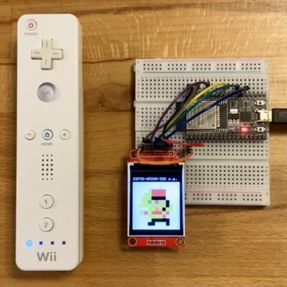
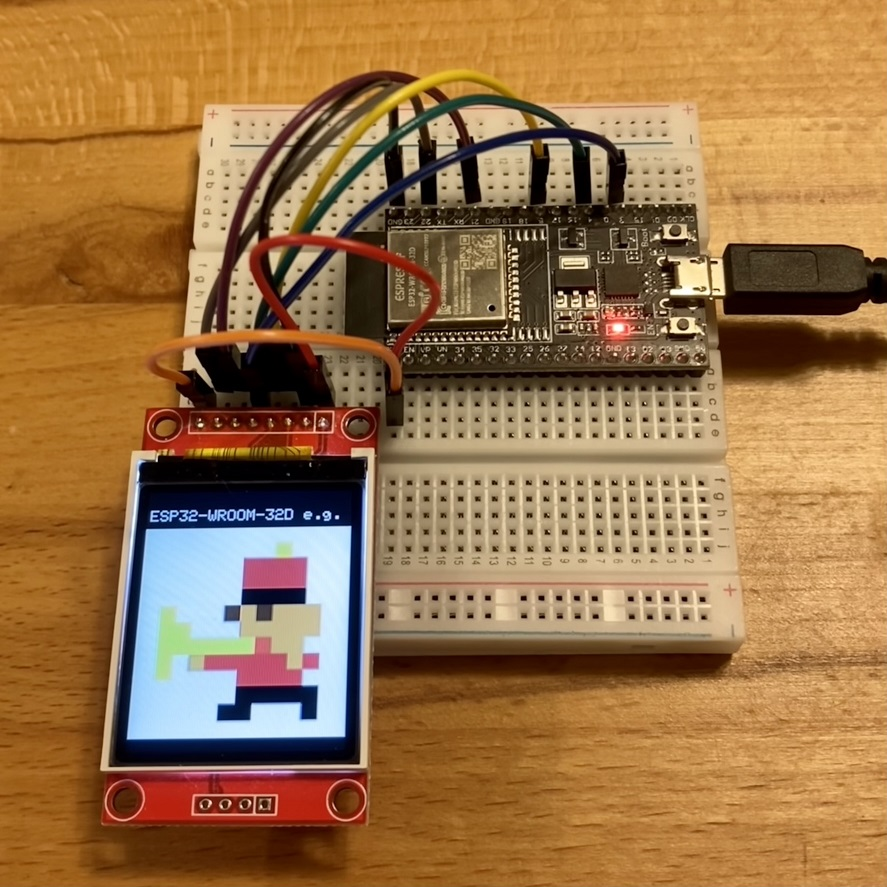

<!-- ABOUT THE PROJECT -->

# 1. プロジェクトについて

ESP32-WROOM-32D を対象としたプロジェクトです。  
Wii リモコンと Bluetooth で接続できる Wiimote ライブラリを使用して  
ESP32 へ LittleFS でアップロードした画像の表示を切り替えることができるスケッチです。

Wii リモコンで操作できますので、これをベースに十字キーで操作できるラジコンを作ったり、  
画面の表示が切り替えられるようなメニューを作成したり、色々な拡張ができます。

takeru さんが作成した Wiimote ライブラリは以下です。ありがとう。

- [Wiimote](https://github.com/takeru/Wiimote)

本スケッチでは以下のパネルをサポートしています。

| ST7735 128x160                                    |
| ------------------------------------------------- |
|  |

(<a href="#readme-top">back to top</a>)

<!-- USAGE EXAMPLES -->

# 2. Arduino IDE

Arduino IDE 1.8.19 を使用しています。「ESP32 Sketch Data Upload」ツールを使用するためです。  
ライブラリは動作確認ができているバージョンです。

- ボードマネージャの追加
  - [ファイル>基本設定>追加のボードマネージャ]：[Arduino-ESP32 の json](https://docs.espressif.com/projects/arduino-esp32/en/latest/installing.html) から追加
  - [ツール>ボード>ボードマネージャ]：「esp32 by Espressif Systems」をインストール
- ボードマネージャの選択
  - [ツール>ボード]：「ESP32 Arduino」の「ESP32 Dev Module」を選択
- ライブラリのインストール
  - [ライブラリマネージャ]：「Adafruit GFX Library 1.11.5」をインストール
  - Wiimote ライブラリをダウンロードし、ArduinoIDE 環境の libraries フォルダへコピー
- ツールインストール
  - [LittleFS](https://github.com/lorol/LITTLEFS)からツールを取得し、Arduino インストールフォルダの tools フォルダへコピーする

(<a href="#readme-top">back to top</a>)

# 3. 配線図

## 3.1. ST7735 128x160

| TFT    | ESP32  |
| ------ | ------ |
| LED    | 3.3V   |
| SCK    | GPIO22 |
| SDA    | GPIO21 |
| A0(DC) | GPIO2  |
| RESET  | GPIO4  |
| CS     | GPIO5  |
| GND    | GND    |
| VCC    | 3.3V   |

(<a href="#readme-top">back to top</a>)

# 4. 環境構築

PC と ESP32 を USB で接続し、Arduino IDE が起動できている状態からの手順です。

1. ツールの「ESP32 Sketch Data Upload」を選択し data の bmp ファイル をコピー
1. スケッチの「マイコンボードに書き込む」を選択
1. 起動後画面に"ESP32-WROOM-32D e.g." "done"と表示されます
1. Wii リモコンの 1,2 ボタンを同時に押す
1. LED が 3 つ点滅し、左端の 1 つのみ点灯すれば接続完了です
1. A ボタンを押すと画面に画像が順に表示されます

起動とリセットを繰り返す場合、シリアルモニタに「Brownout detector was triggered」と表示されていれば  
USB の電源供給が不足していますので、以下をお試しください・

- USB を太いもの(2A 通せるもの)に変更する
- USB HUB を通さず PC に直接つなぐ
- 電源を持つ USB HUB を使用する
- PC でなく USB 充電器に接続する

(<a href="#readme-top">back to top</a>)

# 5. 画像

(<a href="#readme-top">back to top</a>)

# 5. 参考

- [Arduino IDE](https://www.arduino.cc/en/software)
- [ESP-WROOM-32D 開発ボード](https://akizukidenshi.com/catalog/g/gM-13628/)
- [ESP32-WROOM-32D](https://www.digikey.jp/ja/products/detail/espressif-systems/ESP32-WROOM-32D-N4/9381716)
- [Wiimote](https://github.com/takeru/Wiimote)
- [LittleFS](https://github.com/lorol/LITTLEFS)

(<a href="#readme-top">back to top</a>)

