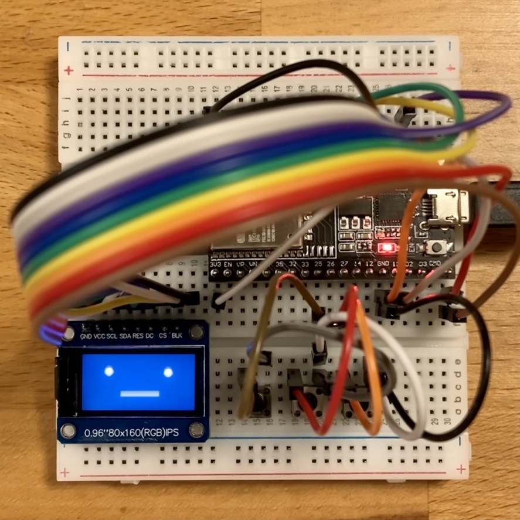

<a name="readme-top"></a>

<!-- ABOUT THE PROJECT -->

# 1. プロジェクトについて

ESP32-WROOM-32D を対象としたプロジェクトです。  
basics は、全てがオープン仕様であるコミュニケーションロボット スタックチャンの M5Stack_Avatar を動かしたスケッチです。  
ライブラリに同梱されている「M5Stack_Avatar\examples\basics」をベースに作成しています。

これをベースに会話をさせたり、スピーカーをつけて音声を発したり、ボタンに機能を割り当てることが可能です。




スタックチャンについて詳しく知りたい方は是非以下へアクセスください。  
このような面白い作品をオーブンにして頂きありがとうございます。

- [スタックチャン（Stack-chan）](https://protopedia.net/prototype/2345)
- [Stack-chan - JavaScript driven super-kawaii robot](https://hackaday.io/project/181344-stack-chan-javascript-driven-super-kawaii-robot)

本スケッチでは以下のパネルをサポートしています。

| ST7735S 80x160                                   | ST7789 240x320                                   | ST7735 128x160                                   |
| ------------------------------------------------ | ------------------------------------------------ | ------------------------------------------------ |
|  |  |  |

<p align="right">(<a href="#readme-top">back to top</a>)</p>

<!-- USAGE EXAMPLES -->

# 2. Arduino IDE

Arduino IDE 2.0.3 を使用しています。1.0 系はコンパイルが重くて完了しない時があります。  
ライブラリは動作確認ができているバージョンです。

- ボードマネージャの追加
  - [ファイル>基本設定>追加のボードマネージャ]：[Arduino-ESP32 の json](https://img.espressif.com/projects/arduino-esp32/en/latest/installing.html) を追加
  - [ツール>ボード>ボードマネージャ]：「esp32 by Espressif Systems」をインストール
- ボードマネージャの選択
  - [ツール>ボード]：「ESP32 Arduino」の「ESP32 Dev Module」を選択
- ライブラリのインストール
  - [ライブラリマネージャ]：「M5Unified 0.1.4」「M5Stack-Avatar 0.8.2」をインストール

<p align="right">(<a href="#readme-top">back to top</a>)</p>

# 3. 配線図

## 3.1. ST7735S 80x160


| TFT       | ESP32  |     | BTN  | ESP32 |
| --------- | ------ | --- | ---- | ----- |
| GND       | GND    |     | GND  | GND   |
| VCC       | 5V     |     | BtnA | GPI25 |
| SCL       | GPI13  |     | BtnB | GPI26 |
| SDA(MOSI) | GPIO15 |     | BtnC | GPI27 |
| RES       | GPIO18 |     |      |       |
| DC        | GPIO23 |     |      |       |
| CS        | GPIO5  |     |      |       |
| BUK       | 3.3V   |     |      |       |

## 3.2. ST7789 240x320

| TFT    | ESP32  |
| ------ | ------ |
| LED    | 3.3V   |
| SCK    | GPI13  |
| SDA    | GPIO15 |
| A0(DC) | GPIO23 |
| RESET  | GPIO18 |
| CS     | GPIO5  |
| GND    | GND    |
| VCC    | 5V     |

## 3.1. ST7735 126x160


| TFT    | ESP32  |     | BTN  | ESP32 |
| ------ | ------ | --- | ---- | ----- |
| LED    | 3.3V   |     | GND  | GND   |
| SCK    | GPI13  |     | BtnA | GPI25 |
| SDA    | GPIO15 |     | BtnB | GPI26 |
| A0(DC) | GPIO23 |     | BtnC | GPI27 |
| RESET  | GPIO18 |     |      |       |
| CS     | GPIO5  |     |      |       |
| GND    | GND    |     |      |       |
| VCC    | 5V     |     |      |       |

<p align="right">(<a href="#readme-top">back to top</a>)</p>

# ソースコード

使用するパネルに合わせて設定を変更します。

```
basics.ino

// ESP32-WROOM-32D で使用するLCDを設定.
panel_t use_panel = panel_t::panel_ST7735S;
```

<p align="right">(<a href="#readme-top">back to top</a>)</p>

# 4. 参考

- [Arduino IDE](https://www.arduino.cc/en/software)
- [ESP-WROOM-32D 開発ボード](https://akizukidenshi.com/catalog/g/gM-13628/)
- [ESP32-WROOM-32D](https://www.digikey.jp/ja/products/detail/espressif-systems/ESP32-WROOM-32D-N4/9381716)
- [スタックチャン（Stack-chan）](https://protopedia.net/prototype/2345)
- [Stack-chan - JavaScript driven super-kawaii robot](https://hackaday.io/project/181344-stack-chan-javascript-driven-super-kawaii-robot)

<p align="right">(<a href="#readme-top">back to top</a>)</p>
