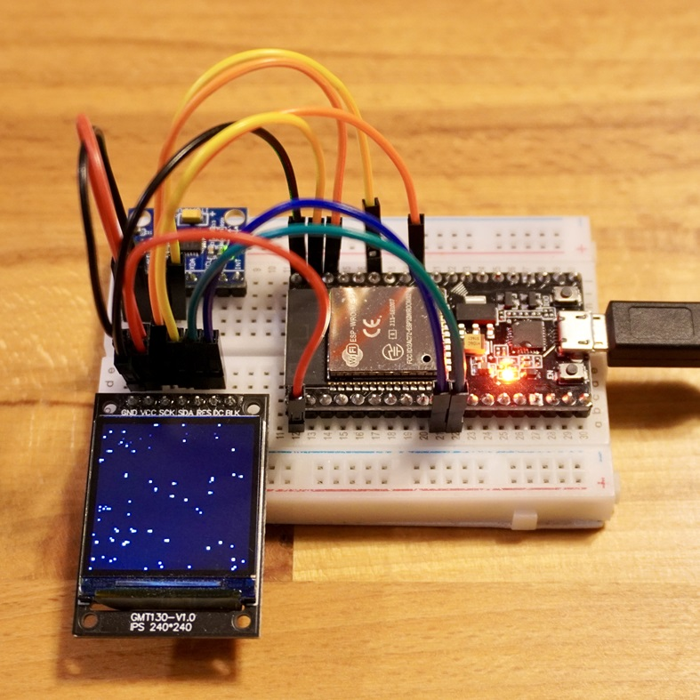
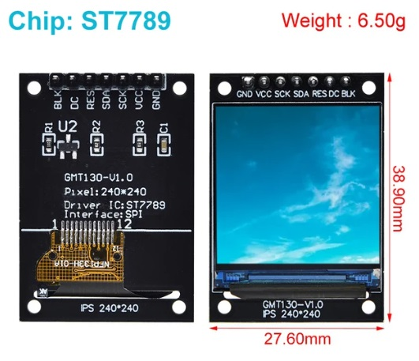

<!-- ABOUT THE PROJECT -->

# 1. プロジェクトについて

NodeMCU-ESP32S を対象としたプロジェクトです。  
Adafruit の PixelDust で表示したデジタルの砂を、加速度センサー MPU6050 モジュールから取得した傾きを使って動かすことができるスケッチです。

X のサンプル動画
https://twitter.com/teatree18841627/status/1762475749741871507

NodeMCU-ESP32S は動作電圧が 3.3V ですので、使用する各モジュールの動作電圧も 3.3V です。

また、本プログラムは以下のライブラリを使用しています。ありがとう。

- Adafruit の ST7789 and PixelDust Library
- Electronic Cats の MPU6050 Library

スケッチは以下のパネルをサポートしています。

| GMT130-V1.0 1.3 inch IPS 240x240 ST7789        |
| ---------------------------------------------- |
|  |

(<a href="#readme-top">back to top</a>)

<!-- USAGE EXAMPLES -->

# 2. Arduino IDE

Arduino IDE の環境構築を行います。バージョンは 2.3.2 を使用しています。
ライブラリは動作確認ができているバージョンです。

- ボードマネージャの追加
  - [ファイル>基本設定>追加のボードマネージャ]：[Arduino-ESP32 の json](https://docs.espressif.com/projects/arduino-esp32/en/latest/installing.html) を追加
  - [ツール>ボード>ボードマネージャ]：「esp32 by Espressif Systems」をインストール
- ボードマネージャの選択
  - [ツール>ボード]：「esp32」の「ESP32 Dev Module」を選択
- ライブラリのインストール
  - [ライブラリマネージャ]：以下のライブラリをインストール
    - Adafruit GFX Library 1.11.9
    - Adafruit ST7735 and ST7789 Library 1.10.3
    - MPU6050 by Electronic Cats 1.3.0

(<a href="#readme-top">back to top</a>)

# 3. 配線図

## 3.1. NodeMCU-ESP32S

## 3.2. 1.3" TFT & MPU6050

| 1.3" TFT | ESP32   |     | MPU6050 | ESP32   |
| -------- | ------- | --- | ------- | ------- |
| GND      | GND     |     | VCC     | 3.3V    |
| VCC      | 3.3V    |     | GND     | GND     |
| SCK      | GPIO 18 |     | SCL     | GPIO 22 |
| SDA      | GPIO 23 |     | SDA     | GPIO 21 |
| RES      | GPIO 27 |     |         |         |
| DC       | GPIO 26 |     |         |         |
| BLK      | -       |     |         |         |

(<a href="#readme-top">back to top</a>)

# 4. 書き込み

NodeMCU-ESP32S は書き込みに失敗するという情報があります。  
その場合には、以下のように GPIO 22 と GND を接続して書き込みください。

(<a href="#readme-top">back to top</a>)

# 5. 参考

- [Arduino IDE](https://www.arduino.cc/en/software)
- [ESP-WROOM-32](https://www.digikey.jp/ja/product-highlight/s/schtoeta/esp32-wroom-32-wi-fi-bluetooth-module?utm_adgroup=General&utm_source=google&utm_medium=cpc&utm_campaign=Dynamic%20Search_JP_Product_RLSA_Purchaser&utm_term=&productid=&gclid=CjwKCAjw3dCnBhBCEiwAVvLcu3xY1uTytVSFJbOtr8_Yn7evGmlZFMUmof6J9unfUyjJlBHtOspJghoC1x0QAvD_BwE)
- [FCCID 2AC7Z-ESPWROOM32](https://fcc.report/FCC-ID/2AC7Z-ESPWROOM32)
- [Adafruit_PixelDust（デジタル砂を表示するためのライブラリ）](https://github.com/adafruit/Adafruit_PixelDust)
- [I2C Device Library（I2C デバイスを使用するためのライブラリ）](https://github.com/jrowberg/i2cdevlib)
- [MPU6050 by Electronic Cats（I2C ライブラリを用いた MPU6050 を使用するためのライブラリ）](https://github.com/ElectronicCats/mpu6050/tree/master)

(<a href="#readme-top">back to top</a>)

