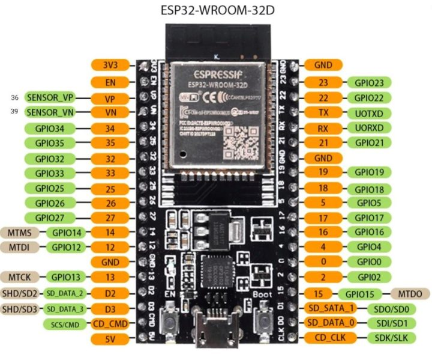
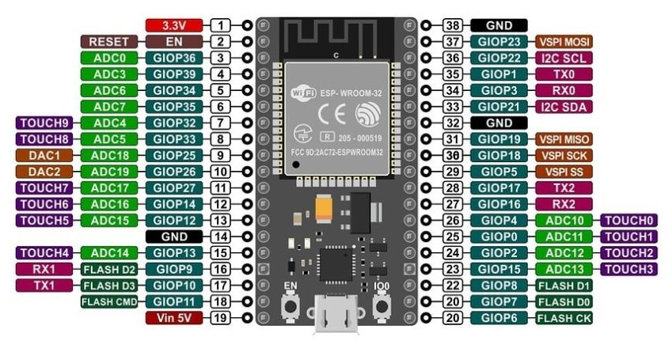

<!-- ABOUT THE PROJECT -->

# 1. プロジェクトについて

ESP32 を対象としたプロジェクトです。  
ここでは、ESP32 の開発ボードで作成したプログラムを展開します。

(<a href="#readme-top">back to top</a>)

<!-- USAGE EXAMPLES -->

# 2. 使い方

ESP32 を使ったプログラムを置いています。各プロジェクトにて詳細確認ください。

- ESP-WROOM-32D
  - BLE_Wiimote : Wii リモコンで画面に表示している画像を変更できるプロジェクト
  - M5Stack_Avatar : オープン仕様スタックチャンの M5Stack_Avatar を使ったプロジェクト
- NodeMCU-ESP32S
  - BLE_DrawImage : BLE リモコンで画面に表示している画像を変更できるプロジェクト

(<a href="#readme-top">back to top</a>)

# 3. 配線図

## 3.1. ESP-WROOM-32D

## 3.2. NodeMCU-ESP32S

(<a href="#readme-top">back to top</a>)

# 4. 参考

- [Arduino IDE](https://www.arduino.cc/en/software)
- [ESP-WROOM-32D 開発ボード](https://akizukidenshi.com/catalog/g/gM-13628/)
- [ESP32-WROOM-32D](https://www.digikey.jp/ja/products/detail/espressif-systems/ESP32-WROOM-32D-N4/9381716)
- [はじめての ESP32 開発ボード](https://burariweb.info/electronic-work/esp-wroom-32d.html)

(<a href="#readme-top">back to top</a>)

